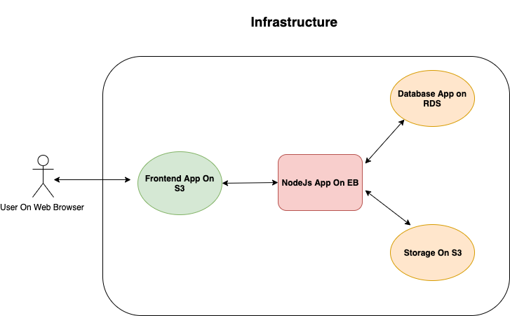

Infrastructure
==============

# Content:
- [Services](#services)
    - [AWS RDS](#aws-rds)
    - [AWS EB](#aws-eb)
    - [AWS S3](#aws-s3)

## Services

### AWS RDS
[Amazon Relational Database Service or RDS](https://aws.amazon.com/rds/) Service form AWS provide relational database (postgres) for our application.

### AWS EB

[AWS Elastic Beanstalk or EB](https://aws.amazon.com/elasticbeanstalk) is an easy-to-use service for deploying and scaling web applications and services developed Node.js,Nginx.

### AWS S3
[Amazon S3 or S3](Amazon S3) Object storage built to retrieve any amount of data from anywhere.

