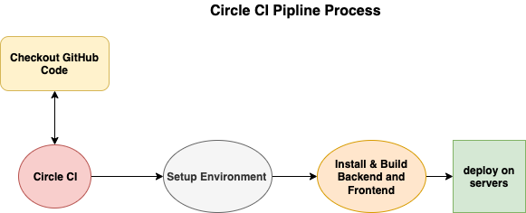

Pipeline Process
==========

## Circle Ci
[CircleCI](https://circleci.com) is the software delivery engine for teams who want to ship software faster and with confidence.

## Steps to CI & CD
- Connect with GitHub repository
- Prepare environment vars
- Checkout code from the determined branch on GitHub repository.
- Install orbs [nodejs,AWS cli, EB cli]
- Configuration AWS ID, SECRET_KEY
- Backend install, build and deploy
- Frontend install, build and deploy

